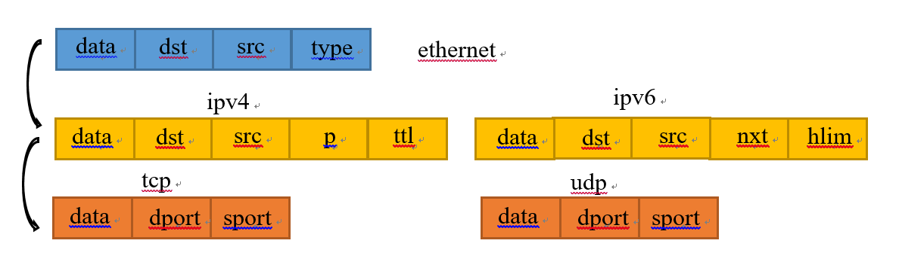
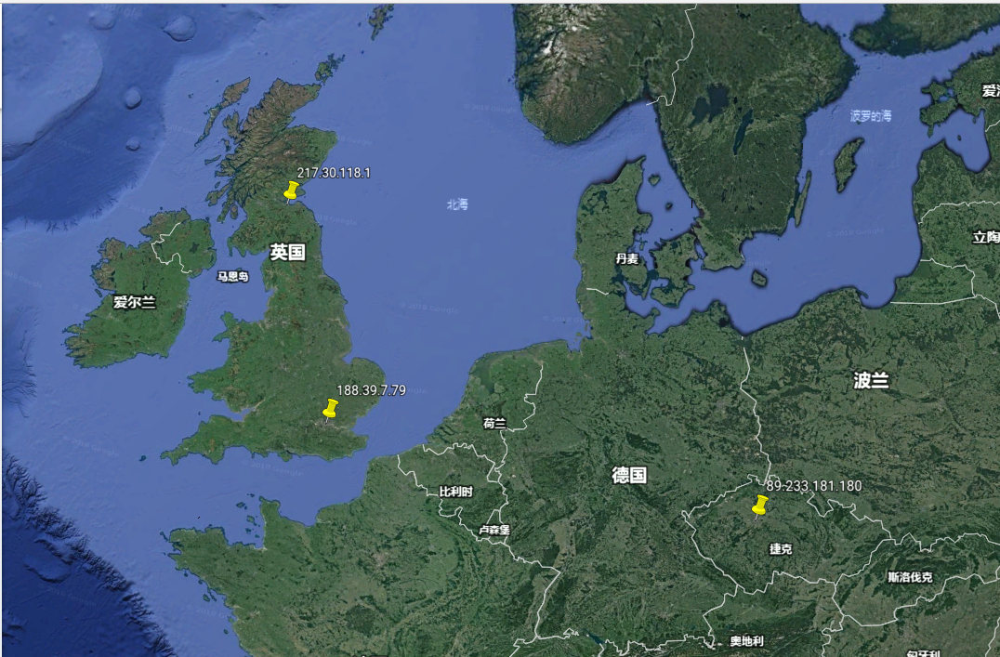
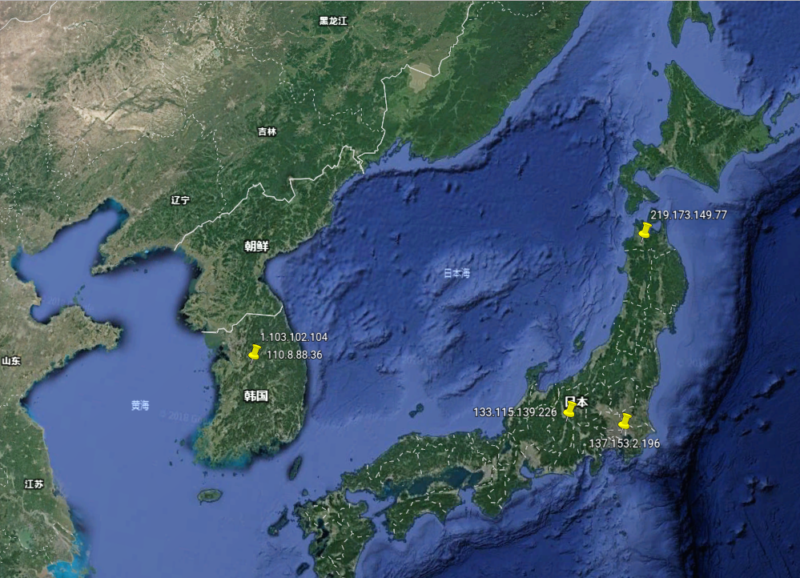
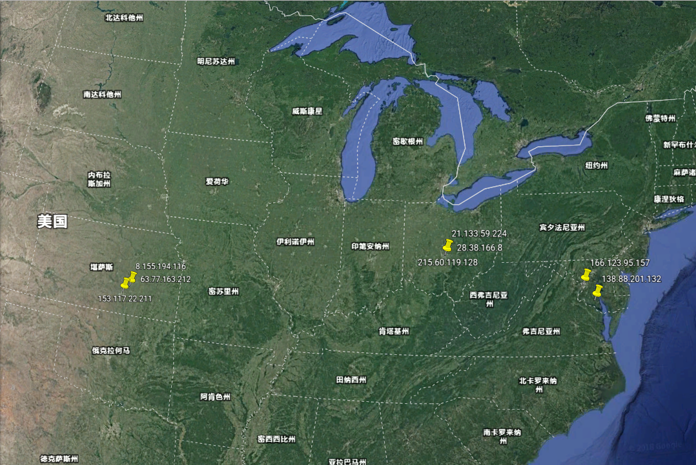

#  第4章　用Python分析网络流量

## 本章简介

- 定位IP流量的地理位置(dpkt)
- 发现恶意分布式拒绝服务(DDos)工具包(dpkt)
- 发现伪装网络扫描(scapy)
- 分析风暴(Storm)僵尸网络中使用的Fast-Flux和Conficker蠕虫中使用的Domain-Flux(scapy)
- 理解TCP序号预测攻击(scapy)
- 生成数据包愚弄入侵检测系统(IDS)(scapy)

## 4.1 用Python定位IP流量

### 引言　＂极光＂行动以及为什么明显的迹象会被忽视

2010年1月14日，美国政府获悉一起多路协同、老练且持久的网络攻击，攻击目标为谷歌、Adobe及其他30多家世界财富100强企业（Binde, McRee, &O'Connor, 2011)。
在这次被称为“极光”行动（该名称源于一台被黑的计算机上发现的文件夹名字）的攻击中，使用了一个之前从未被使用过的新型漏洞利用代码，尽管微软先前知道这个
系统漏洞，但他们错误地以为没有其他人知道它，因此也就没有要检测类似攻击的机制。

在实施攻击的过程中，攻击者首先会向被攻击者发送一封带有指向台湾某个含有恶意JavaScrip代码的网站链接的电子邮件（Binde, McRee, &O'Connor, 2011)。当用户
单击这个链接时，就会下载一个回到一台位于中国大陆的命令行控制服务器的恶意软件（Zetter, 2010)。之后，攻击者就能利用新获得的访问权限寻找存储在被黑的系
统中他们所关心的信息。

攻击很明显的出现了但在长达数月的时间里却未被检测出来，而是成功的渗透进了许多家世界100强企业的源码仓库，甚至是基本的网络检测软件也能识别这次行为。为
什么一个位于美国的世界100强公司有这么多员工连接上中国台湾的某个特定的网站之后，紧接着又去连接位于中国大陆的某个特定服务器呢？一个可视化的地图显示用
户连接台湾和中国具有显著的频率可以允许网络管理员调查这次攻击，并在相关信息泄露之前切断它。

在下面的内容中，我们运用Python分析多种不同类型的的攻击行为，以便快速解析出使用了大量不同数据点的攻击。

### 4.1.1 使用PyGeoIP关联IP地址的物理位置

#### **工具**

开源数据库： **GeoLiteCity** [download](https://dev.maxmind.com/geoip/legacy/geolite/#Databases)

python模块:pygeoip **GeoIP**类 [api](https://pygeoip.readthedocs.io/en/v0.3.2/api-reference.html)

- record_by_name(hostname)
- record_by_addr(addr)
- country_code_by_addr(addr)
- country_name_by_addr(addr)
- id_by_addr(addr)
- region_by_addr(addr)
- time_zone_by_addr(addr)
- ...

**record_by_name(hostname)**

- 城市 (city)
- 区域号 (region_code)
- 区号 (area_code)
- 时区(time_zone)
- 经度 (latitude)
- 纬度 (longitude)
- 邮政编码（postal_code)
- 国名(country_name)
- 大陆(continent)
- ...

#### **代码**
```C
import pygeoip
gi = pygeoip.GeoIP('./opt/GeoIP/GeoIP.dat')
den printRecord(tgt):
	rec = gi.record_by_name(tgt)
	city = rec['city']
	region = rec['region_name']
	country = rec['country_name']
	long = rec['longitude']
	lat = rec['latitude']
	print('[*] Target: ' + tgt + ' Geo-located. ')
	print('[+] '+str(city)+', '+str(region)+', '+str(country))
	print('[+] Latitude: '+str(lat)+ ', Longitude: '+ str(long))
tgt = '173.255.226.98'
printRecord(tgt)
```

#### **结果**
```
[*] Target: 172.255.226.98 Geo-located.
[+] None, None, Netherlands
[+] Latitude: 52.3824, Longitude: 4.8995

[*] Target: baudu.com Geo-located.
[+] Beijing, 22, China
[+] Latitude: 39.9289, Longitude: 116.3883
```

### 4.1.2使用Dpkt解析包 [api](https://dpkt.readthedocs.io/en/latest/api/index.html)

#### **读取数据包**
```
pcap = dpkt.pcap.Reader(file)
 |
 |_ [timestamp,packet]
```
#### **解析数据包**
```
dpkt.ethernet.Ethernet(packet)
```
#### **解包流程图**



#### **代码**

```C
import dpkt
import socket

def printPcap(pcap):
	for (ts, buf) in pcap:
		try:
			eth = dpkt.ethernet.Ethernet(buf)
			ip = eth.data
			src = socket.inet_ntoa(ip.src)
			dst = socket.inet_ntoa(ip.dst)
			print('[+] Src: ' + src + ' --> Dst: ' + dst)
		except:
			pass

def main():
	f = open('data.pcap')
	pcap = dpkt.pcap.Reader(f)
	printPcap(pcap)

if __name__ == '__main__':
	main()
```

**改进**：加入一个函数来返回指定IP地址对应的物理地址

```C
gi = pygeoip.GeoIP('/opt/GeoIP/GeoIP.dat')
def retGeoStr(ip):
	try:
		rec = gi.record_by_name(ip)
		city = rec['city']
		country = rec['country_code3']
		if city != '':
			geoLoc = city + ', ' + country
		else:
			geoLoc = country
		return geoLoc
ecept Exception as e:
	return 'Unregistered'
```
#### **结果**
```
[+] Src: 110.8.88.36 --> Dst: 188.39.7.79
[+] Src: 28.38.166.8 --> Dst: 21.133.59.224
[+] Src: 153.117.22.211 --> Dst: 138.88.201.132
[+] Src: 1.103.102.104 --> Dst: 5.246.3.148
[+] Src: 166.123.95.157 --> Dst: 219.173.149.77
[+] Src: 8.155.194.116 --> Dst: 215.60.119.128
[+] Src: 133.115.139.226 --> Dst: 137.153.2.196
[+] Src: 217.30.118.1 --> Dst: 63.77.163.212
[+] Src: 57.70.59.157 --> Dst: 89.233.181.180
```
### 4.1.3使用Python画谷歌地图

谷歌地球能在一个专门的界面中显示出一个虚拟地球仪、地图和地理信息。虽然用的是专门的界面，但谷歌地球可以让你很方便地在地球仪上画出指定位置或轨迹。通
过创建一个扩展名为KML的文体文件，用户可以把许多个地理位置标大谷歌地球上。KML文件中是下面规定的XML结构。

```
<?xml version="1.0" encoding="UTF-8"?>
<kml xmlns="http://www.opengis.net/kml/2.2">
	<Document>
		<Placemark>
			<name>93.170.52.30</name>
			<Point>
				<coordinates>5.750000,52.500000</coordinates>
			</Point>
		</Placemark>
		<Placemark>
			<name>208.73.210.87</name>
			<Point>
				<coordinates>-122.393300,37.769700</coordinates>
			</Point>
		</Placemark>
	</Document>
</kml>
```

我们有了IP地址和对应的物理位置的经纬度，给已有的脚本加上创建KML文件的功能，就可以通过生成的KML文件IP地址的物理位置在谷歌地球上展示出来。

```
def retKML(ip):
	rec = gi.record_by_name(ip)
	try:
		longitude = rec['longitude']
		latitude = rec['latitude']

		kml =
		('<Placemark>\n'
		'<name>%s</name>\n'
		'<Point>\n'
		'<coordinates>%6f,%6f</coordinates>\n'
		'</Point>\n'
		'</Placemark>\n'
		)
		% (ip,longitude, latitude)

		return kml
	except Exception, e:
		return ''
```

我们可以通过这样一个函数构建表示该IP所对应的物理位置的KML结构，如出现异常（没找到对应的地点），则返回一个空串。
还需根据规定添加所需的KML头和尾。

```
kmlheader = '<?xml version="1.0" encoding="UTF-8"?>\n
             <kml xmlns="http://www.opengis.net/kml/2.2">\n<Document>\n'

kmlfooter = '</Document>\n</kml>\n'
```
#### 结果

把KML文件导入谷歌地图后可以看到在地图上的标志如下：





## 4.2 ＂匿名者＂真能匿名吗？分析LOIC流量

2010年12月，荷兰警方逮捕了一名少年，他被控参与对Visa、MasterCard 和Papal进行了分布式拒绝服务攻击，而该攻击又是一场针对那反对维基解密的公司而发起的行动的一个组成部分。

之后不到一个月，美国联邦调查局（FBI）发出40张调查令，英国警方又逮捕5人。这些被指控的犯罪嫌疑人与“匿名者”黑客集团保持着松散关系，他们下载并使用一个名为LOIC（Low Orbit Ion Cannon，低轨道离子炮）的分布式拒绝服务工具包。

LIOC使用大量的UDP和TCP流量对目标进行拒绝服务式攻击。单台计算机上的LOIC程序只能消耗目标很少一部分的资源。但是，台果成百上千台计算机上同时使用LOIC，将很快耗尽目标的资源以及提供服务的能力。

LOIC提供了两种操作模式。在第一种模式下，用户可以输入目标的地址。在第二被称为HIVEMIND（蜂群）的模式下，用户将LOIC连接到一台IRC服务器上，在这台服务器上，用户可以提出发动攻击，连接在这台服务器上的IRC用户就会自动对该目标进行攻击。

### 4.2.1使用Dpkt发现下载LOIC行为


#### TJ O'Conner, Violent Python: A Cookbook for Hackers, Forensic Analysts, Penetration Testers and Security Engineers[M]. Syngress, 2012-11-22

[loic](https://nchc.dl.sourceforge.net/project/loic/loic/loic-1.0.8/LOIC-1.0.8-binary.zip)

#### 下载行为判别
- HTTP 请求：GET（下载该工具需要发出一个 HTTP GET 请求）
- 关键字：loic (project/loic/loic/loic-1.0.8/LOIC-1.0.8-binary.zip)

#### 代码
```
def findDownload(pcap):
    for (ts, buf) in pcap:
        try:
            eth = dpkt.ethernet.Ethernet(buf)
            ip = eth.data
            src = socket.inet_ntoa(ip.src)
            tcp = ip.data
            http = dpkt.http.Request(tcp.data)
            if http.method == 'GET':
                uri = http.uri.lower()
                print uri
                if '.zip' in uri and 'loic' in uri:
                    print '[!] ' + src + ' Downloaded LOIC.'
        except Exception, e:
            print str(e)
            pass
```

### 4.2.2解析Hive服务器上的IRC命令

只下载LOIC并不一定是非法的，然而，连接到“匿名者”的HIVE，并发动分布式拒绝服务攻击，想要打瘫某个服务，就违法了。

要发起攻击，“匿名者”成员需要登录到指定的IRC服务器上发出一攻击指令，如 !lazor targetip=66.211.169.66 message=test_test port=80 method=tcp wait=false random=true start。

#### 攻击行为判别
- 端口：6667（在大多数情况下，IRC服务器使用的是TCP 6667端口）
- 指令：!lazor (!lazor targetip=66.211.169.66...)

#### 代码
```
def findHivemind(pcap):
    for (ts, buf) in pcap:
        try:
            eth = dpkt.ethernet.Ethernet(buf)
            ip = eth.data
            src = socket.inet_ntoa(ip.src)
            dst = socket.inet_ntoa(ip.dst)
            tcp = ip.data
            dport = tcp.dport
            sport = tcp.sport
            if dport == 6667:
                if '!lazor' in tcp.data.lower():
                    print '[!] DDoS Hivemind issued by: '+src
                    print '[+] Target CMD: ' + tcp.data
            if sport == 6667:
                if '!lazor' in tcp.data.lower():
                    print '[!] DDoS Hivemind issued to: '+src
                    print '[+] Target CMD: ' + tcp.data
        except:
            pass
```

### 4.2.3实时监测DDoS攻击

#### 攻击行为判别

设置一个不正常的数据包量的阈值。当某一用户发送到某个地址的数据包的数量超过了这个阈值，就表示该用户存在攻击行为。

#### 代码
```
def findAttack(pcap):
    pktCount = {}
    for (ts, buf) in pcap:
        try:
            eth = dpkt.ethernet.Ethernet(buf)
            ip = eth.data
            src = socket.inet_ntoa(ip.src)
            dst = socket.inet_ntoa(ip.dst)
            tcp = ip.data
            dport = tcp.dport
            if dport == 80:
                stream = src + ':' + dst
                if pktCount.has_key(stream):
                    pktCount[stream] = pktCount[stream] + 1
                else:
                    pktCount[stream] = 1
        except:
            pass

    for stream in pktCount:
        pktsSent = pktCount[stream]
        if pktsSent > THRESH:
            src = stream.split(':')[0]
            dst = stream.split(':')[1]
            print '[+] '+src+' attacked '+dst+' with ' \
                + str(pktsSent) + ' pkts.'
```

将这些代码放在一起，我们的脚本就能检测到下载行为，监听到HIVE指令并检查出攻击行为。

如果监测到某一用户下载了LOIC，随后收到一条HIVE指令，接着又发起了攻击，就能证明该用户参与了“匿名者”发起的DDoS攻击。

## 4.3 H.D.Moore是如何解决五角大楼的麻烦的

1999年年末，美国五角大楼的计算机网络面临了一场严重危机。美国国防总部五角大楼宣布其正遭受一系列协调一致的老练攻击。

新发布的工具--Nmap 让任何人都能很容易地扫描出网络中的服务和漏洞。五角大楼担心袭击者利用Nmap探测五角大楼大型计算机网络中的漏洞。

检测出Nmap扫描非常容易，而且还可以查出攻击者的IP地址，并依次找出该IP的物理地址。但Nmap的高级选项里可以选择输入其他IP地址进行伪装扫描（decoy scan），五角大楼的专家很难区分数据包中的IP是否真实。

正当专家们努力用理论方法对大量的数据记录进行分析和研究时，来自克萨斯大学奥斯汀分校的一名**仅17岁的年轻人(Stephen Northcutt)**却最终找到了解决方案。

这个年轻人建议用TTL字段分析所有来自Nmap扫描的数据包。IP数据包的TTL（time-to-live)字段可以确定在到达目的地之前数据包经过了几跳。每当一个数据包经过一个路由设备时，路由器会将TTL字段的值减去1。

### 4.3.1理解TTL字段

字段大小： 8bit(1字节)

范围： 0～255

作用：限制数据包在计算机网络中的存在的时间，数据包每经过一个路由设备，TTL值就自减一。当TTL值为零时，路由器就丢掉该数据包，以防无限路由循环。

### 4.3.2Nmap伪装扫描

命令：

```
nmap [-p <port ranges>]  <target IP>  -D <decoy1,decoy2[,ME],...>] [-ttl <val>]
```
其中：

**target IP:** 扫描的主机IP，多个用空格隔开

**decoy1,decoy2[,ME],...:** 伪装的IP地址，ME可用来代替本机IP

### 4.3.3用Scapy解析TTL字段

我们要写一个函数进行嗅探，并检查嗅探到的数据包的IP层，将数据包的源IP地址和TTL字段的值提取出来

```
from scapy.all import *
def testTTL(pkt):
	try:
		if pkt.haslayer(IP):
		ipsrc = pkt.getlayer(IP).src
		ttl = str(pkt.ttl)
		print '[+] Pkt Received From: ' + ipsrc + ' with TTL: ' + ttl
	except:
		pass

def main():
	sniff(prn=testTTL, store=0)

if __name__ == '__main__':
	main()
```

**sniff函数：**

```
sniff(count=0, store=True, offline=None, prn=None, lfilter=None, L2socket=None, timeout=None, opened_socket=None, stop_filter=None, iface=None, *arg, **karg)
```

有了嗅探到的数据包的源IP地址与TTL字段的值，我们还需要写一个函数来获取该源IP真正的TTL字段值来进行对比，

走不同路径到达目标主机的数据包所经过的路由设备的数量可能会有所差异，因此其TTL也可能不完全一样，

但如果真实TTL值与收到的数据包的TTL值的差值超过了某个阈值，比如5,则认为该TTL值是假的。

```
import time
import optparse
from scapy.all import *
from IPy import IP as IPTEST

ttlValues = {}
THRESH = 5


def checkTTL(ipsrc, ttl):
    if IPTEST(ipsrc).iptype() == 'PRIVATE':
        return

    if not ttlValues.has_key(ipsrc):
        pkt = sr1(IP(dst=ipsrc) / ICMP(), \
          retry=0, timeout=1, verbose=0)
        ttlValues[ipsrc] = pkt.ttl

    if abs(int(ttl) - int(ttlValues[ipsrc])) > THRESH:
        print '\n[!] Detected Possible Spoofed Packet From: '\
          + ipsrc
        print '[!] TTL: ' + ttl + ', Actual TTL: ' \
            + str(ttlValues[ipsrc])


def testTTL(pkt):
    try:
        if pkt.haslayer(IP):
            ipsrc = pkt.getlayer(IP).src
            ttl = str(pkt.ttl)
            checkTTL(ipsrc, ttl)
    except:

        pass


def main():
    parser = optparse.OptionParser("usage %prog "+\
      "-i <interface> -t <thresh>")
    parser.add_option('-i', dest='iface', type='string',\
      help='specify network interface')
    parser.add_option('-t', dest='thresh', type='int',
      help='specify threshold count ')

    (options, args) = parser.parse_args()
    if options.iface == None:
        conf.iface = 'eth0'
    else:
        conf.iface = options.iface
    if options.thresh != None:
        THRESH = options.thresh
    else:
        THRESH = 5

    sniff(filter="! port 22", prn=testTTL, store=0)


if __name__ == '__main__':
    main()
```

**局限性：**

- 默认的TTL初始值为64,而MS Windows NT 4.0 起的 Windows系统已经把TTL的初始值设为128, 某些UNIX系统的TTL初始值也可能不同，比如Solaris 2.x的默认TTL是225
- 不同网段的IP地址经过转换有所变化

## 4.4 ＂风暴＂(Storm)的fast-flux和Conficker的domain-flux

2007年，安全研究人员发现了一种新的在臭名昭著的风暴（Storm）僵尸网络上使用的技术（Higgins ，2007）。这种名为fast-flux的技术使用域名服务(DNS)记录隐藏指

挥风暴僵尸网络的控制与命令信道。DNS记录一般是用来将域名转换成IP地址的。当DNS服务器返回一个结果时，它同时会指定一个TLL----告诉主机这个IP地址在多长的时

间里肯定是有效的，因而在这段时间里无须再次解析域名。

风暴僵尸网络背后的攻击者会非常频繁地改变用于指挥与控制服务器的DNS记录。事实上，他们使用了分布在50多个国家的384个网络供应商手上的2000多台冗余服务器。

攻击者频繁地切换指挥与控制的服务器的IP地址，并在DNS查询结果中的返回一个很短的TTL。这种快速变化IP地址的做法（fast-flux）使得安全研究员很难找出僵尸网络

的指挥与控制服务器，更别说关掉这些服务器了。

尽管使用fast-flux之后，风暴僵尸网络已经很难被打垮了，但不到一年，另一种类似的技术又被用来帮助入侵200多个国家里的700万台电脑（Binde，2011）。Conficker

是迄今为止最成功的电脑蠕虫病毒，它通过Windows服务消息块（Windows Service Message Block，SMB ）协议中的一个漏洞传播。一旦被感染，有漏洞的机器便联络命令

与控制服务器，以获得进一步的命令。想要阻止攻击，识别并阻断“肉机”与指挥的控制服务器之间的通信是绝对必要的。然而，Conficker每三个小时会使用UTC格式的当前

日期生成一批不同的域名。对Conficker第三个版本来说，这意味着每三个小时生成50000个域名。攻击者中注册了这些域名的很少部分，让它们能映射成真正的IP地址。这

使得拦截和阻止来自命令与控制服务器的流量变得非常困难。由于该技术是轮流使用域名的，所以研究人员便将其命名为domain-flux。

下面将编写能在真实环境中检测出fast-flux和domain-flux，并识别出攻击的Python脚本。


### 4.4.1回顾DNS（Domain Name System）


### 4.4.2用Scapy解析DNS流量

### 4.4.3用Scapy找出fast-flux流量

### 4.4.4用Scapy找出Domain Flux流量

## 4.5 Kevin Mitnick和TCP序列预测

1996 年 2 月 16 日结束了一个臭名昭著的黑客的统治。其疯狂的犯罪行为包含
盗取价值数百万美元的商业机密。15 年来,凯文米特尼克获得未授权访问计算
机,窃取私人信息,试图抓他的人都厌倦了,但是最后一个针对他的小组抓到
了他。
Tsutomu Shimomura,一个计算物理理学家,帮助逮捕了米特尼克。在
1992 的手机安全听证会后,米特尼克便成为了他的目标。1994 年 12 月,有人
闯入了他家的电脑系统。相信这次攻击是米特尼克并被他的新的攻击方法所着
迷,他本来领导的 LED 团队在第二年开始追踪米特尼克。
他好奇攻击向量是什么,以前从没见到过,米特尼克用了一个方法劫持了
TCP 会话。这种技术被称为 TCP 序列预测,攻击缺乏随机性的序列号跟踪单个
网络连接。这个技术接合 IP 地址欺骗,允许米特尼克劫持他家电脑的一个连接。
在下面的章节中,我们将重现并编写米特尼克曾经使用过的 TCP 序列预测的工
具和攻击。

### 预测你自己的TCP序列号

米特尼克攻击过的机器有一个可靠的远程连接服务协议。这个远程服务能访问
米特尼克的受害者,通过运行在 TCP 513 端口上的远程登陆协议(rlogin)。而不
是使用公钥协商或者是密码方式,rlogin 使用了一个不安全的认证方法---检查
源 IP 地址。因此,为了攻击 Shimomura 的电脑米特尼克必须 1.找到一个可信
的服务器;2.沉默的可信服务器;3.欺骗来自服务器的连接;4.盲目的欺骗正确
的 TCP 三次握手包的 ACK 包。听起来比实际上更难,1994 年 1 月 25 日,
	Shimomura 发布了这次攻击的详细描述在新闻博客上。通过看他发布的技术细
	节分析这次攻击,我们将编写一个 Python 脚本来执行类似的攻击。
	在米特尼克确认了 Shimomura 的私人电脑上有一个可靠的远程服务,他需要那
	个机器沉默。如果机器注意到尝试使用他的 IP 地址欺骗连接,机器将会发送重
	置数据包关闭连接。为了让机器沉默,米特尼克发送了一类咧的 TCP SYN 包到
	服务器的登陆端口。被称为 SYN 洪水攻击,这个攻击充满了服务器的连接序列
	并保持它的响应。从 Shimomura 发布的细节来看,我们看到一系列的 TCP
	SYN 包发送到目标主机的登陆端口。


### 使用Scapy制造SYN泛洪攻击

### 计算TCP序列号

现在攻击变得有一些有趣了。随着远程服务器的沉默,米特尼克可以欺骗目标
的 TCP 连接。然而,这取决于他发送伪造的 SYN 的能力,Shimomura 机器
TCP 连接后的一个 TCP ACK 数据包。为了完成连接,米特尼克需要需要正确的
猜到 TCP ACK 的序列号,因为他无法观察到他,并返回一个正确的猜测的 TCP
ACK 序列号。为了正确计算 TCP 序列号,米特尼克从名为 apollo.it.luc.edu 的
大学机器发送了一系列的 SYN 数据包,收到 SYN 之后,Shimomura 的机器的
终端响应了一个带序列号的 TCP ACK 数据包注意下面隐藏技术细节的序列号:
2022080000, 2022208000, 2022336000, 2022464000。每个增量相差
128000,这让计算正确的 TCP 序列号更加容易。( 注意,大多数现代的操作系
		统今天提供更强大的随机 TCP 序列号。)

### 伪造TCP连接

## 4.6 使用Scapy愚弄入侵检测系统

入侵检测系统(Intrusion Detection System, IDS)是主管分析师手中一个非常有价值的工具。一个基于网络的
入侵检测系统(network-based intrusion detection system,NIDS)可以通过记录 IP 网络数据包实时分析流量。
通过匹配已知恶意标记的数据包,IDS 可以在攻击成功之前提醒网络分析师。例如，Snort入侵检测系统通过预先
包装各种不同的规则来检测不同类型的侦查,攻击,拒绝服务等其他不同的攻击向量。审查其中一个配置的内容,
我们看到四个报警检测 TFN,tfn2k 和 Trin00 分布式拒绝服务的攻击工具。当攻击者使用 TFN,tfn2k 或者 Trin00
工具攻击目标,IDS 检测到攻击然后警告分析师。

然而,当分析师接收到大量警告，使他们难以对事件进行合理判断时，他们往往不知所措,可能会错过重要的攻击细节。

### 4.6.1 snort规则


## 本章小结


